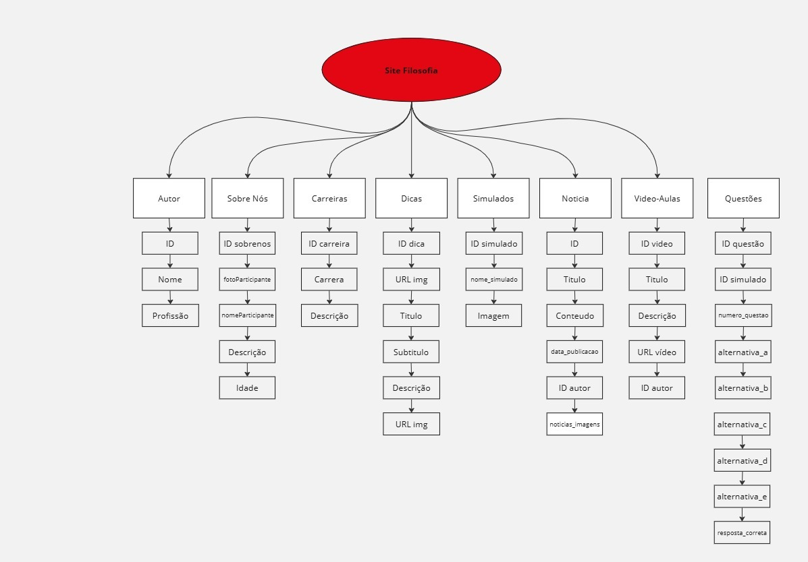

# PROJETO FINAL DE BANCO DE DADOS

### O Projeto Final do conteúdo de banco de dados deve contemplar a transferência das informações do projeto final da matéria de Projetos, que se baseia em um Portal Educacional que é composto por matérias estudadas no Ensino Médio, como Matemática, Português, Geografia, Filosofia, Inglês, Sociologia, Física, Química, Biologia, História e Educação Física e Artes, em um único banco composto de tabelas e relacionamentos. O foco é aplicar os conceitos e funcionalidades presentes do site no SQL.

## Equipe:
### Product Owner (PO): João Vitor Porto Sales.
### Scrum Master: Isabella Borin de Moraes Rosa.
### Desenvolvedores:
#### <li> Ana Julia Demattei;
#### <li> Anna Beatriz Ribeiro Valentim;
#### <li> Bernardo Gabriel de Moraes Marques.

## Tecnologias Utilizadas:

### <li> SQL;
### <li> Criação do Diagrama: Miro.

## MER (MODELO ENTIDADE RELACIONAMENTO)

### ENTIDADES: 
<li> TABELA cardDicas
<li> TABELA sobrenos
<li> TABELA carreiras
<li>TABELA simulados
<li>TABELA questoes
<li>TABELA videos
<li>TABELA autores
<li>TABELA noticias
<li>TABELA noticias_imagens

### ATRIBUTOS:

#### cardDicas
    id SERIAL PRIMARY KEY
    titulo VARCHAR(50)
    subtitulo VARCHAR(100)
    descricao VARCHAR(1500)
    imgDicas VARCHAR(300)

#### sobrenos
	id_sobrenos SERIAL PRIMARY KEY
   	uhn VARCHAR(255) NOT NULL
   	nomeParticipante VARCHAR(100) NOT NULL
    descricao TEXT NOT NULL
    idade INTEGER NOT NULL

#### carreiras
	id_carreira SERIAL PRIMARY KEY,
    carreira VARCHAR(100) NOT NULL
    url_imagem VARCHAR(255) NOT NULL
    descricao_carreira TEXT NOT NULL

#### simulados
		id_simulado SERIAL PRIMARY KEY
    	nome_simulado VARCHAR(250) NOT NULL
  		imagem VARCHAR(255) NOT NULL

 #### questoes
	id_questao SERIAL PRIMARY KEY
  	id_simulado INTEGER NOT NULL
   	numero_questao INTEGER NOT NULL
    alternativa_a BOOLEAN NOT NULL
    alternativa_b BOOLEAN NOT NULL
   	alternativa_c BOOLEAN NOT NULL
    alternativa_d BOOLEAN NOT NULL
   	alternativa_e BOOLEAN NOT NULL
    resposta_correta VARCHAR(1) NOT NULL
   	CONSTRAINT fk_simulado  FOREIGN KEY (id_simulado) REFERENCES simulados(id_simulado)

#### videos
 	id_video SERIAL PRIMARY KEY
    titulo VARCHAR(150) NOT NULL
    descricao TEXT NOT NULL
   	url_video VARCHAR(150) NOT NULL
    id_autor INT NOT NULL
    FOREIGN KEY (id_autor) REFERENCES autor(id_autor)

#### autores
	id_autor SERIAL PRIMARY KEY
  	nome VARCHAR(200) NOT NULL
    profissao VARCHAR(100) NOT NULL

#### noticias
   	id SERIAL PRIMARY KEY
    titulo VARCHAR(255) NOT NULL
    descricao_conteudo TEXT NOT NULL
    data_publicacao DATE NOT NULL
    autor_id INT NOT NULL
    CONSTRAINT fk_autor FOREIGN KEY (autor_id) REFERENCES autor (id)

#### noticias_imagens 
	id SERIAL PRIMARY KEY
    noticia_id INT NOT NULL
    url_imagem VARCHAR(255) NOT NULL
    CONSTRAINT fk_noticia FOREIGN KEY (noticia_id) REFERENCES noticias (id)

## DER (DIAGRAMA ENTIDADE-RELACIONAMENTO)

